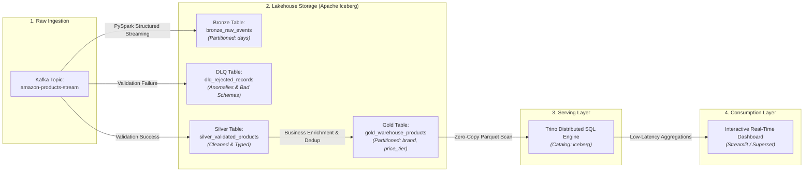

# Enterprise Lakehouse Data Lineage

```mermaid
flowchart LR
    subgraph S1["1. Raw Ingestion"]
        K1["Kafka Topic:<br/>amazon-products-stream"]
    end

    subgraph S2["2. Lakehouse Storage (Apache Iceberg)"]
        B["Bronze Table:<br/>bronze_raw_events<br/><i>(Partitioned: days)</i>"]
        DLQ["DLQ Table:<br/>dlq_rejected_records<br/><i>(Anomalies & Bad Schemas)</i>"]
        S["Silver Table:<br/>silver_validated_products<br/><i>(Cleaned & Typed)</i>"]
        G["Gold Table:<br/>gold_warehouse_products<br/><i>(Partitioned: brand, price_tier)</i>"]
    end

    subgraph S3["3. Serving Layer"]
        T["Trino Distributed SQL Engine<br/><i>(Catalog: iceberg)</i>"]
    end

    subgraph S4["4. Consumption Layer"]
        D["Interactive Real-Time Dashboard<br/><i>(Streamlit / Superset)</i>"]
    end

    K1 -->|PySpark Structured Streaming| B
    K1 -->|Validation Failure| DLQ
    K1 -->|Validation Success| S
    S -->|Business Enrichment & Dedup| G
    G -->|Zero-Copy Parquet Scan| T
    T -->|Low-Latency Aggregations| D
```